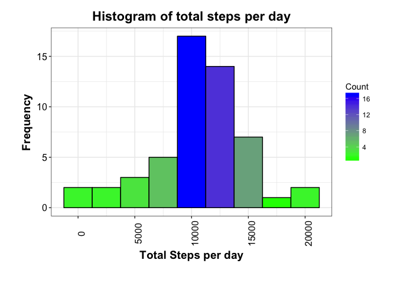
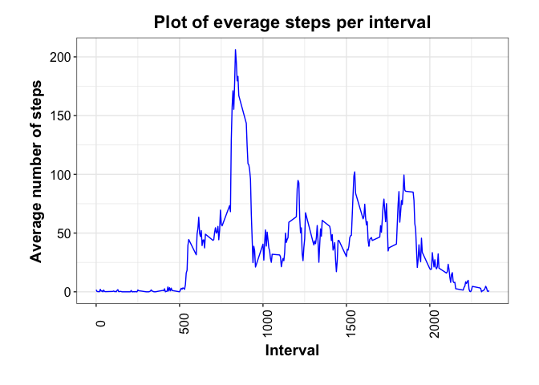
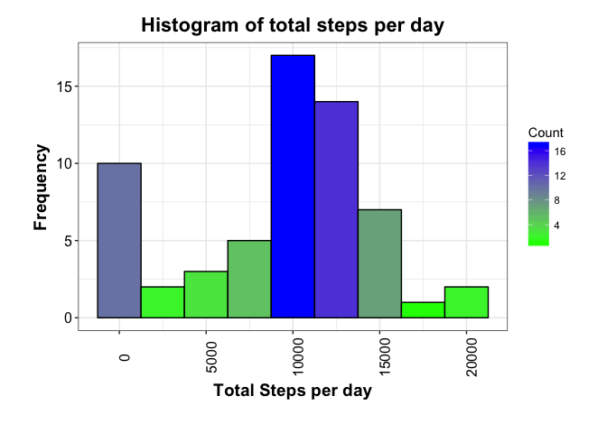
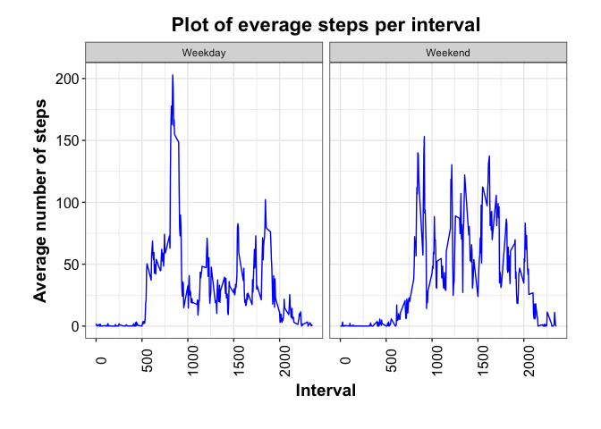

# Reproducible Research: Peer Assessment 1


## 0. load libraries

```r
library(dplyr)
```

```
## 
## Attaching package: 'dplyr'
```

```
## The following objects are masked from 'package:stats':
## 
##     filter, lag
```

```
## The following objects are masked from 'package:base':
## 
##     intersect, setdiff, setequal, union
```

```r
library(ggplot2)
library(xtable)
library(lubridate)
```

```
## 
## Attaching package: 'lubridate'
```

```
## The following object is masked from 'package:base':
## 
##     date
```

```r
library(knitr)
library(markdown)
library(mice)
```

```
## Loading required package: Rcpp
```

```
## mice 2.25 2015-11-09
```


#### 1. Code for reading in the dataset and/or processing the data

```r
unzip("activity.zip")
activity<-tbl_df(read.csv("activity.csv", header = TRUE))
```

####2. Histogram of the total number of steps taken each day
##### a. What is mean total number of steps taken per day?

```r
activityByDate<-activity %>%
    filter(!is.na(steps))%>%
    group_by(date)%>%
    summarise(totalStepsPerDay = sum(steps), 
              count = n(), 
              avgStepsPerDay = mean(steps), 
              mdnStepsPerDay = median(steps))

ggplot(activityByDate, aes(totalStepsPerDay))+
    geom_histogram(aes(fill = ..count..), binwidth =2500, col = "black")+
    scale_fill_gradient("Count", low = "green", high = "blue") +
    theme_bw() + 
    ylab("Frequency") + 
    xlab("Total Steps per day") +
    ggtitle("Histogram of total steps per day") +
    theme(
        plot.title = element_text(size = rel(1.5), color = "black", face = "bold", hjust = 0.5),
        plot.margin = unit(c(.5,1,1,1), "cm"),
        axis.title.x = element_text(color="black", size=rel(1.3), face="bold"),
        axis.title.y = element_text(color="black", size=rel(1.3), face="bold"),
        axis.text.x = element_text(color="black", size=12, angle = 90), 
        axis.text.y = element_text(color="black", size=12))
```

<!-- -->
#### 3. Mean and median number of steps taken each day
###### mean

```r
mean(activityByDate$totalStepsPerDay)
```

```
## [1] 10766.19
```
######median

```r
median(activityByDate$totalStepsPerDay)
```

```
## [1] 10765
```

#### 4. Time series plot of the average number of steps taken

```r
activityByInterval <- activity %>%
    filter(!is.na(steps)) %>%
    group_by(interval) %>%
    summarise(totalStepsPerInterval = sum(steps), 
              count = n(), 
              avgStepsPerInterval = mean(steps), 
              mdnStepsPerInterval = median(steps))

ggplot(activityByInterval, aes(interval, avgStepsPerInterval)) + 
    geom_line(col = "blue")+ 
    labs(title="Plot of everage steps per interval",
         y ="Average number of steps", 
         x = "Interval")+
    theme_bw() +
    theme(
        plot.title = element_text(size = rel(1.5), color = "black", face = "bold", hjust = 0.5),
        plot.margin = unit(c(.5,1,1,1), "cm"),
        axis.title.x = element_text(color="black", size=rel(1.3), face="bold"),
        axis.title.y = element_text(color="black", size=rel(1.3), face="bold"),
        axis.text.x = element_text(color="black", size=12, angle = 90), 
        axis.text.y = element_text(color="black", size=12))
```

<!-- -->

#### 5. The 5-minute interval that, on average, contains the maximum number of steps

```r
max<-activityByInterval[which.max(activityByInterval$avgStepsPerInterval), ]
select(max, c(interval,avgStepsPerInterval))
```

```
## # A tibble: 1 × 2
##   interval avgStepsPerInterval
##      <int>               <dbl>
## 1      835            206.1698
```


#### 6. Code to describe and show a strategy for imputing missing data
######Using "mice" library to impute missing values
#######create subset of variables you would like to either impute or use as predictors for imputation.


```r
Dat1 <- subset(activity, select=c(steps, date, interval)) 
ini <- mice(Dat1, maxit=0, pri=F)
pred <- ini$pred
pred[,c("interval", "date")] <- 0
```
########variables you do not want to use as predictors (but want to have in the dataset.

```r
meth <- ini$meth
meth[c("interval", "date")] <- "" 
```
########choose a prediction method for imputing your variables.

```r
imp <- mice(Dat1, m=5, maxit=10, printFlag=FALSE, pred=pred, meth=meth, seed=2345)
Datimp <- complete(imp, "long", include=TRUE)
```
####7. Histogram of the total number of steps taken each day after missing values are imputed

```r
activityImp <- Datimp %>%
    filter(.imp == 5) %>%
    select(steps:interval)

activityImpByDate<-activityImp %>%
    group_by(date)%>%
    summarise(totalStepsImpPerDay = sum(steps), 
              count = n(), 
              avgStepsImpPerDay = mean(steps), 
              mdnStepsPerImpDay = median(steps))

stepsImpSummary<-activityImp %>%
    filter(!is.na(steps))%>%
    summarise(avgStepsImpPerDay = mean(steps), 
              mdnStepsImpPerDay = median(steps))

ggplot(activityImpByDate, aes(totalStepsImpPerDay))+
    geom_histogram(aes(fill = ..count..), binwidth =2500, col = "black")+
    scale_fill_gradient("Count", low = "green", high = "blue") +
    theme_bw() + 
    ylab("Frequency") + 
    xlab("Total Steps per day") +
    ggtitle("Histogram of total steps per day") +
    theme(
        plot.title = element_text(size = rel(1.5), color = "black", face = "bold", hjust = 0.5),
        plot.margin = unit(c(.5,1,1,1), "cm"),
        axis.title.x = element_text(color="black", size=rel(1.3), face="bold"),
        axis.title.y = element_text(color="black", size=rel(1.3), face="bold"),
        axis.text.x = element_text(color="black", size=12, angle = 90), 
        axis.text.y = element_text(color="black", size=12))
```

<!-- -->

####8. Panel plot comparing the average number of steps taken per 5-minute interval across weekdays and weekends

##### Mean and median number of steps after NA values are imputed
###### mean

```r
mean(activityImpByDate$totalStepsImpPerDay)
```

```
## [1] 9354.23
```
######median

```r
median(activityImpByDate$totalStepsImpPerDay)
```

```
## [1] 10395
```
######Are these values different?


###### What is the impact?
Mean is lower.  Median different, but not by that much.


##### Panel Plot

```r
activityImpWeekdays <- activityImp %>%
    mutate(wkday = weekdays(ymd(date))) %>%
    mutate(WDorWE = ifelse(wkday == "Saturday" | wkday == "Sunday", "Weekend", "Weekday"))

activityWDorWEByInterval <- activityImpWeekdays %>%
    group_by(WDorWE,interval) %>%
    summarise(WDorWEtotalStepsPerInterval = sum(steps), 
              count = n(), 
              WDorWEavgStepsPerInterval = mean(steps), 
              WDorWEmdnStepsPerInterval = median(steps))

ggplot(activityWDorWEByInterval, aes(interval, WDorWEavgStepsPerInterval)) + 
    geom_line(col = "blue")+ 
    facet_grid(.~WDorWE) +
    labs(title="Plot of everage steps per interval",
         y ="Average number of steps", 
         x = "Interval")+
    theme_bw() +
    theme(
        plot.title = element_text(size = rel(1.5), color = "black", face = "bold", hjust = 0.5),
        plot.margin = unit(c(.5,1,1,1), "cm"),
        axis.title.x = element_text(color="black", size=rel(1.3), face="bold"),
        axis.title.y = element_text(color="black", size=rel(1.3), face="bold"),
        axis.text.x = element_text(color="black", size=12, angle = 90), 
        axis.text.y = element_text(color="black", size=12))
```

<!-- -->

